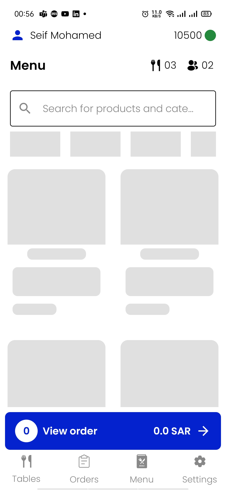
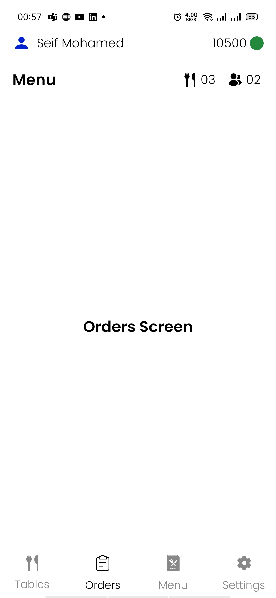
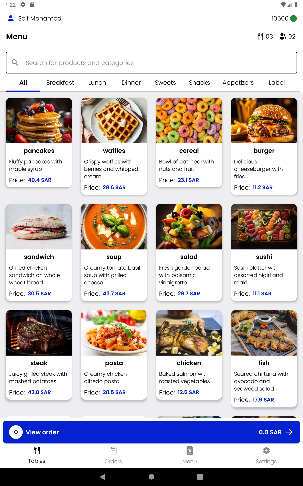

# Foodics App 🥗 

This mobile application allows users to search for products, manage orders, and interact with categories. 
It features an intuitive and responsive design, ensuring smooth navigation even on varying screen sizes. 
The app integrates with mock APIs to fetch categories and product data, providing real-time updates. 
The app stores product and category data locally, ensuring a seamless experience when searching, filtering, and managing cart items.

# Features 📱 

Search Products  
&nbsp;&nbsp;&nbsp;&nbsp;• Users can search for products by name using an intuitive search bar. 
&nbsp;&nbsp;&nbsp;&nbsp;• The search dynamically filters products based on the entered text. 
&nbsp;&nbsp;&nbsp;&nbsp;• Matching results are displayed in real time for a seamless user experience. 
  
Order Management  
• Products can be added to the cart by tapping on them directly and saved in database to keep cart data even when user kill the app. 
&nbsp;&nbsp;&nbsp;&nbsp;• The "View Order" button at the bottom of the screen: 
&nbsp;&nbsp;&nbsp;&nbsp;&nbsp;&nbsp;&nbsp;&nbsp;- Displays the total price and quantity of products in the cart. 
&nbsp;&nbsp;&nbsp;&nbsp;&nbsp;&nbsp;&nbsp;&nbsp;- Clears the order when pressed, resetting the cart data for a new order. 
&nbsp;&nbsp;&nbsp;&nbsp;• Cart data is stored in a Room database, ensuring: 
&nbsp;&nbsp;&nbsp;&nbsp;&nbsp;&nbsp;&nbsp;&nbsp;- Products and order details persist across search, filter, and navigation. 
&nbsp;&nbsp;&nbsp;&nbsp;&nbsp;&nbsp;&nbsp;&nbsp;- A consistent experience even after app relaunch. 
    
API Integration 
  • The app integrates with mock APIs (Mockaroo) to fetch: 
&nbsp;&nbsp;&nbsp;&nbsp;- Products List 
&nbsp;&nbsp;&nbsp;&nbsp;- Categorys List 
&nbsp;&nbsp;&nbsp;&nbsp;- Fetched data is stored in the Room database for offline use. 
    
Design and Responsiveness 
&nbsp;&nbsp;&nbsp;&nbsp;• Designed exclusively for portrait mode, optimizing the user experience for mobile devices. 
&nbsp;&nbsp;&nbsp;&nbsp;• UI elements are fully responsive, ensuring: 
&nbsp;&nbsp;&nbsp;&nbsp;&nbsp;&nbsp;&nbsp;&nbsp;- Consistent layouts across different screen sizes and resolutions. 
&nbsp;&nbsp;&nbsp;&nbsp;&nbsp;&nbsp;&nbsp;&nbsp;- A visually appealing experience on a variety of Android devices. 
    
Dark Theme Support 
&nbsp;&nbsp;&nbsp;&nbsp;• The app fully supports Dark Theme, providing: 
&nbsp;&nbsp;&nbsp;&nbsp;&nbsp;&nbsp;&nbsp;&nbsp;- Enhanced usability in low-light conditions. 
&nbsp;&nbsp;&nbsp;&nbsp;&nbsp;&nbsp;&nbsp;&nbsp;- A modern and visually pleasing aesthetic for users. 

# Technologies Used 🛠️ 
The app is built using modern Android development tools and practices, following the MVVM Clean Architecture pattern. Here's a breakdown of the technologies used:   

• Kotlin 
• Compose 
• MVVM Clean Architecture 
• Ktor 
• Gson 
• Koin 
• Coroutines 
• State Flow 
• Coil 
• ROOM 
• Lottie Animation 
• Junit 
• Mockk 
• Turbine 

# Securing Api Key 👮🏻
• To secure the API key in this project, we used the BuildConfigField approach, which injects the API key during the build process. The key is stored securely in the local.properties file, which is not tracked by version control, and is injected into the app at build time. This avoids hardcoding the key directly into the source code, making it more secure.

Additional Security Options:

• **Encrypted SharedPreferences:** Securely stores sensitive data, such as API keys, on the device by encrypting it before storing it. However, it can still be accessed if the device is compromised.

• **NDK (Native Development Kit):** Stores sensitive data in native C++ code, making it more difficult to reverse-engineer. It offers an added layer of security but is not entirely foolproof against skilled attackers.

# Supported Android Version ℹ
• Android 9 (Api 28) and above

# Test Coverage 🧪

This project includes comprehensive **unit tests** and **UI tests** to ensure the robustness and reliability of the application:

• **Unit Tests**  
Implemented unit tests for almost all features and scenarios of the application.
These tests cover core business logic, data transformations, and edge cases to ensure the app behaves as expected across different use cases.

• **UI Tests**  
The project also includes extensive UI test cases for the Tables Screen using Jetpack Compose Testing.
By covering both unit and UI testing, we aim to provide a reliable user experience and maintain the app's quality over time.

## Demo Videos 🎬
Light Theme

  

Dark Theme

  

# Screen Shots 🖼

 
 

 
 

 
 

 
 

 
 

 
 

 
 

 
 

 
 

 
 

 
 

 
 
